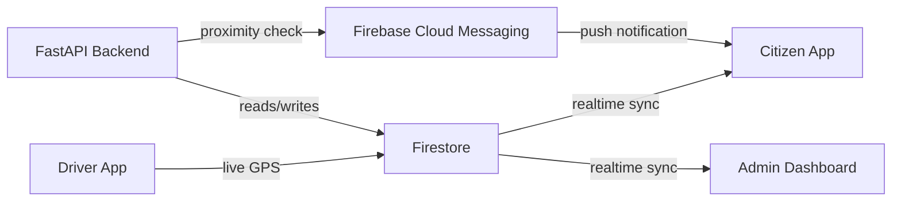

# SmartWaste AI

Real-time garbage truck tracking platform for smart cities — built for the **Gen AI Academy APAC** hackathon.

SmartWaste AI lets municipal authorities and citizens track waste collection trucks live on a map, get pickup schedules and proximity notifications, and gives city admins a dashboard to monitor fleet coverage, missed pickups, and route efficiency.

## Features

- 🚛 **Driver App** — drivers log in, start/end shifts, and stream live GPS location while on route
- 📍 **Citizen App** — live map of nearby trucks, estimated arrival times, and push notifications when a truck is close
- 🖥️ **Admin Dashboard** — live fleet map, route coverage tracking, missed pickup reports, and basic analytics
- 🔔 **Real-time notifications** — proximity-based alerts via Firebase Cloud Messaging

## Tech Stack

| Layer | Tech |
|---|---|
| Mobile apps | Flutter (Citizen App + Driver App) |
| Backend | FastAPI (Python) |
| Realtime / Auth / Storage | Firebase (Firestore, Firebase Auth, FCM) |
| Maps | Google Maps SDK (Flutter) + Google Maps JS API (web) |
| Admin dashboard | React / Flutter Web |

## Architecture



## Project Structure

```
smartwaste-ai/
├── backend/            # FastAPI backend + Firebase Admin SDK
├── driver_app/         # Flutter app for drivers
├── citizen_app/         # Flutter app for citizens
├── admin_dashboard/    # Web dashboard for city admins
└── README.md
```

## Getting Started

### Prerequisites
- Flutter SDK
- Python 3.10+
- Firebase project (or Firebase Emulator Suite for local dev)
- Google Maps API key

### Backend
```bash
cd backend
python -m venv venv
source venv/bin/activate
pip install -r requirements.txt
uvicorn main:app --reload
```

### Driver App / Citizen App
```bash
cd driver_app   # or citizen_app
flutter pub get
flutter run
```

### Admin Dashboard
```bash
cd admin_dashboard
npm install
npm start
```

### Environment Variables
Create a `.env` file (backend) and `firebase_options.dart` (Flutter apps) with your Firebase project config and Google Maps API key. Sample files are provided as `.env.example` and `firebase_options.example.dart`.

## Demo Flow
1. Driver starts a shift and moves along an assigned route
2. Citizen app shows the truck moving live on the map
3. A proximity notification fires when the truck nears the citizen's zone
4. Admin dashboard updates route coverage and fleet status in real time

## Team / Hackathon
Built as a submission for the **Gen AI Academy APAC** hackathon.

## License
MIT
